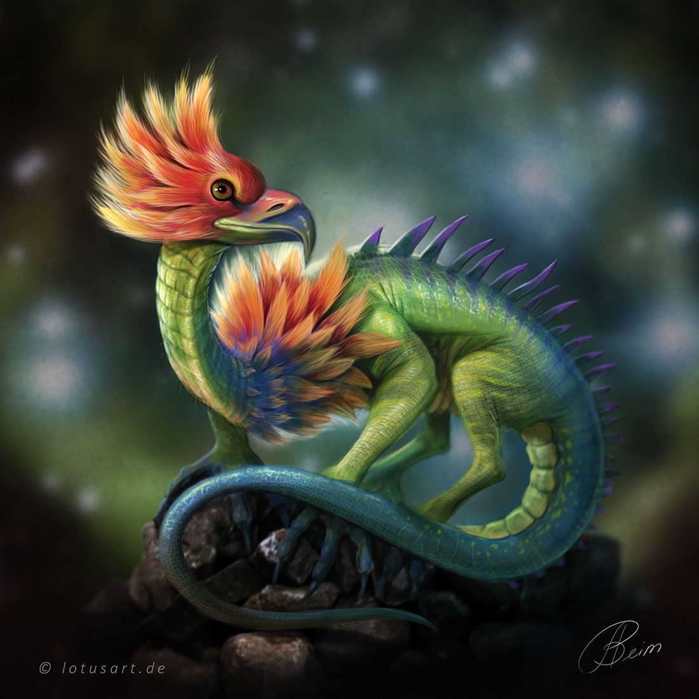
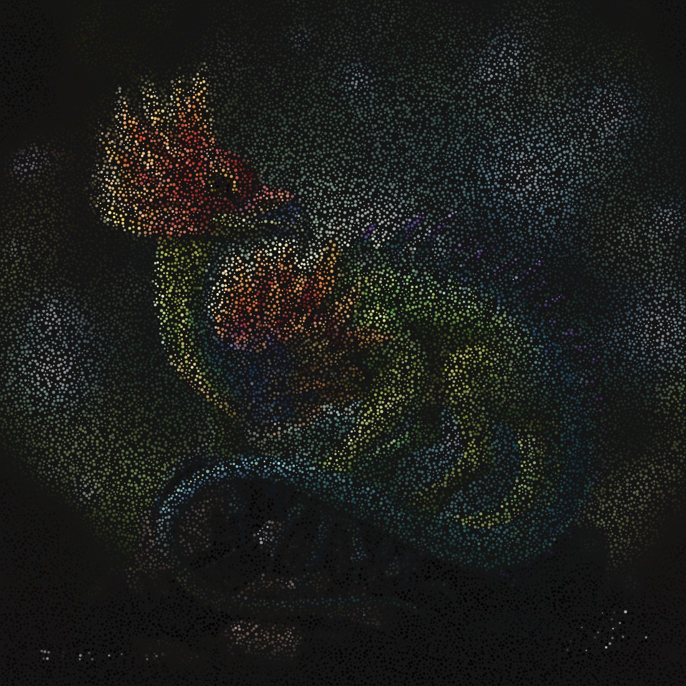
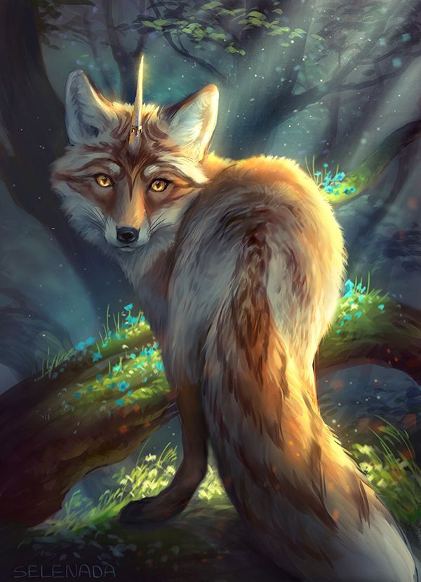

## Mosaic Art Generator
This project creates beautiful circle-based mosaic artworks from any input image using Processing.

Each circle randomly picks a color from the input image's pixels and grows until it touches another circle or hits the edge of the canvas. The result is a unique, organic mosaic where the original image is transformed into a dreamy composition of colored circles!

## How It Works
The algorithm begins by randomly selecting a pixel from the input image. At the selected location, a small circle is placed, adopting the color of the corresponding pixel. Each circle progressively increases in size over time, simulating organic growth.

The growth of a circle halts under two conditions: when it comes into contact with another circle, or when it reaches the boundary of the canvas. Once a circle stops growing, the program continues by attempting to add new circles in available empty spaces. This process is repeated iteratively until no more valid spaces remain for the placement of additional circles.

Several key parameters influence the behavior and visual outcome of the artwork. These include the growth speed of the circles, the number of new circles attempted per frame, the maximum number of placement attempts, and the resizing of the original image. Additionally, adjusting the initial radius and growth behavior of the circles can lead to a variety of different artistic styles. By fine-tuning these parameters, users can create mosaics that range from highly detailed and dense compositions to more abstract and expressive forms.

# Parameter	Description
By fine-tuning the following parameters, users can generate mosaics that are sharper, denser, smoother, or exhibit a more abstract appearance.

* growSpeed: Determines the rate at which circles expand. Lower values result in slower growth, allowing for higher-resolution outputs.

* total: Specifies the number of new circles the program attempts to place during each frame.

* attempts: Defines the maximum number of placement attempts before the program terminates the current frame’s execution.

* Image Width/Height: Adjusting the dimensions of the input image can significantly alter the visual outcome, producing effects ranging from pixelated to highly detailed or stretched compositions.

* Circle Radius Behavior: Modifying the initial radius or the growth behavior of circles can lead to a wide variety of artistic styles.

## Usage
Install Processing.

Clone this repository.

Place your input image in the project folder.

Update the image filename inside the code:
* image = loadImage("your_image.jpg");

Run the sketch and watch the artwork grow!

Press the mouse at any time to save a screenshot.

# Examples

All examples images are taking from a google images search.

